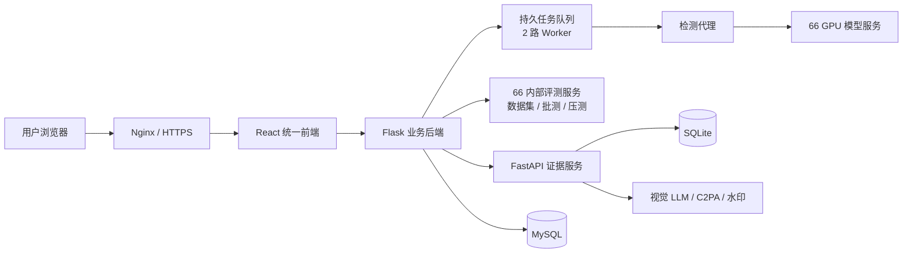

<p align="center">
  
</p>

# 慧鉴 AI

慧鉴 AI 是一个面向 AI 生成内容的鉴伪与证据分析平台。用户上传图片、视频或文档后，系统组合主鉴伪模型、水印、元数据、OCR、内容凭证和视觉复核，输出结论、证据与 PDF 报告。

> 公网地址：[www.rrreal.cn](https://www.rrreal.cn/) · [开发与运维指南](docs/HANDOFF_GUIDE.md) · [开发者平台说明](docs/DEVELOPER_PLATFORM.md)

## 一分钟理解

| 问题 | 答案 |
| --- | --- |
| 用户看到什么？ | 官网、统一 Agent 工作台、历史记录和开发者平台 |
| 核心能力是什么？ | 图像鉴伪、显式水印、视频抽帧、PDF/Word 逐图检测、元数据实拍证据、Swarm 复核 |
| 主前端在哪里？ | `v2-agent/frontend` |
| 业务后端在哪里？ | `realguard-server-main/RealGuard` |
| 模型在哪里运行？ | 66 GPU 服务器，公网服务器负责排队和转发 |
| 数据存在哪里？ | 业务数据在 MySQL/V2 SQLite；内部评测图片只保存在 66 数据盘 |
| 怎么发布？ | 使用 `scripts/deploy_*.sh`，不要手工覆盖服务器文件 |

## 系统架构



快速检测先返回 GPU 主模型结论，视觉 LLM 在后台补充证据；前端通过长轮询获取更新，不阻塞用户等待。

## 主要功能

| 功能 | 说明 |
| --- | --- |
| 快速检测 | 主鉴伪模型、可见水印和元数据融合 |
| Swarm 检测 | 多专家并行复核，适合对快速结果不满意时使用 |
| 水印分析 | YOLO 定位、OCR、Logo 检索和平台规则融合 |
| 实拍证据 | 相机型号、拍摄参数、时间和定位等元数据证据 |
| 视频检测 | 抽取关键帧，逐帧执行图像与水印检测 |
| 文档检测 | 从 PDF、DOCX 的正文、页眉和页脚提取图片，逐张检测并汇总 |
| 证据与报告 | 展示关键依据，导出图片或 PDF 报告 |
| 开发者平台 | API Key、额度、计费、用量和多语言示例 |
| 管理后台 | 用户、模型、任务、地图、大屏、批测和压测 |

单张图片最终结果只显示“真实图像”或“AI生成图像”。文档批量任务若存在未完成子项，会明确标记“未形成完整结论”，避免把部分失败误报为真实。

## 仓库结构

| 目录 | 用途 |
| --- | --- |
| `v2-agent/frontend/` | 当前公网 React 前端 |
| `v2-agent/backend/` | FastAPI 证据服务 |
| `realguard-server-main/RealGuard/` | Flask 业务后端、任务、历史和后台 |
| `realguard-server-main/frontend/` | 旧前端，仅用于兼容和回滚 |
| `services/` | GPU 主模型、水印和实验服务 |
| `deploy/` | Nginx、systemd 和第三方部署配置 |
| `scripts/` | 发布、状态检查、压测和研究辅助脚本 |
| `skills/` | 面向 Agent 的慧鉴鉴伪 Skill |
| `docs/` | 交接、开发者平台和测试报告 |

## 技术栈

| 领域 | 技术 |
| --- | --- |
| 前端 | React 18、TypeScript、Vite、Lucide |
| 业务 API | Flask、Gunicorn、MySQL、PyMySQL |
| 证据 API | FastAPI、Uvicorn、SQLite |
| 模型 | ONNX Runtime、CUDA、OpenCV、YOLO |
| 证据 | C2PA、EXIF、OCR、水印检索、视觉 LLM |
| 运维 | Nginx、systemd、Bash、Let's Encrypt |
| 测试 | Pytest、ESLint、TypeScript 构建、Playwright、压测脚本 |

## 快速开始

建议使用 Python 3.12+、Node.js 20+、npm 和 `uv`。

### 1. 启动业务后端

```bash
cd realguard-server-main/RealGuard
python3.12 -m venv .venv
source .venv/bin/activate
pip install -r requirements.txt
cp .env.example .env
python run.py
```

### 2. 启动证据后端

```bash
cd v2-agent/backend
cp .env.example .env
uv sync --frozen
uv run uvicorn app.main:app --host 127.0.0.1 --port 8848
```

### 3. 启动统一前端

```bash
cd v2-agent/frontend
npm ci
npm run dev
```

本地完整检测还需要 MySQL、模型服务和合法环境变量。环境变量模板可以提交，真实密钥不能提交。

## 测试与发布

最常用检查：

```bash
cd realguard-server-main/RealGuard && .venv-test/bin/python -m pytest tests
cd v2-agent/backend && uv run --with pytest pytest tests
cd v2-agent/frontend && npm run lint && npm run test:layout
```

首次运行浏览器布局测试时，先执行 `npm run test:layout:install`。布局测试会用 Chromium 与 WebKit 检查手机、短屏桌面、宽屏和关键断点，阻止标题折成单字列、首屏内容被裁切、横向溢出、控件重叠与键盘交互回归。

生产状态：

```bash
DEPLOY_SSH_KEY=/path/to/key STRICT=1 ./scripts/check_deploy_status.sh
```

生产发布：

```bash
DEPLOY_SSH_KEY=/path/to/key ./scripts/deploy_v1.sh
DEPLOY_SSH_KEY=/path/to/key ./scripts/deploy_v2.sh
```

模型或水印服务变更使用 `scripts/deploy_detection_service.sh`。完整步骤、日志命令和故障处理见 [开发与运维指南](docs/HANDOFF_GUIDE.md)。

## 必须遵守

1. 用户数据只按不可变 `account_uuid` 隔离，不能按手机号或不同数据库的自增 ID 回退。
2. 模型失败必须明确报错，禁止返回 Mock、随机结果或伪造证据。
3. `.env`、私钥、数据库、用户上传和备份不进入 Git。
4. 修改鉴伪概率或阈值前先阅读 [PROBABILITY_MODEL.md](PROBABILITY_MODEL.md)。
5. 所有生产发布都通过仓库脚本完成，并在发布后运行严格状态检查。

## 交接入口

- 新接手人：[开发与运维指南](docs/HANDOFF_GUIDE.md)
- API 开发：[开发者平台说明](docs/DEVELOPER_PLATFORM.md)
- 当前容量：[容量测试报告](docs/CAPACITY_TEST_REPORT_2026-07-19.md)
- 第三方依赖：[THIRD_PARTY_NOTICES.md](docs/THIRD_PARTY_NOTICES.md)

生产数据和账号权限需要线下单独移交。代码仓库中不包含任何生产密钥。
